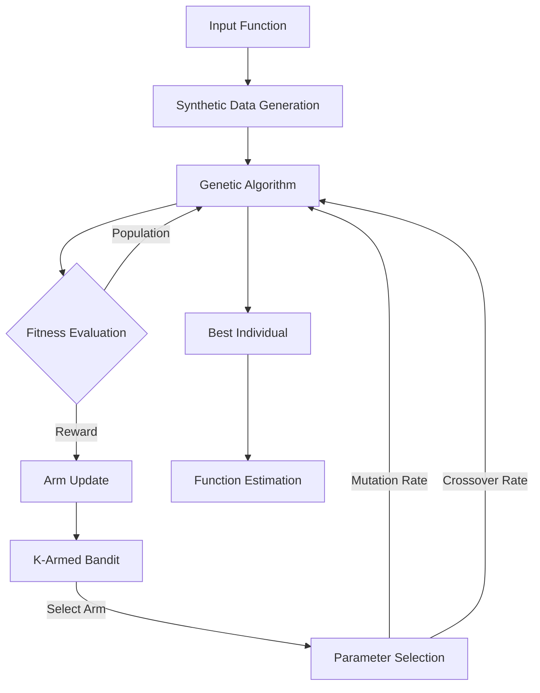

## K-Armed Bandit Genetic Algorithm System Architecture Explanation

### System Architecture

### #System Operation

1. The process begins with the input function, from which synthetic data is generated.
2. In each iteration (generation):
   a. The K-Armed Bandit selects an arm (parameter set).
   b. The GA evolves the population using these parameters.
   c. Fitness evaluation assesses the quality of solutions.
   d. The improvement in best fitness is used as a reward to update the selected arm's value.
3. Over multiple generations, the system learns which parameter combinations (arms) tend to produce the best results for this specific problem.
4. The best individual from the final generation provides the function estimation.

This architecture combines the global search capabilities of Genetic Algorithms with the adaptive learning of the K-Armed Bandit approach, creating a robust system for function estimation and potentially other optimization problems.
